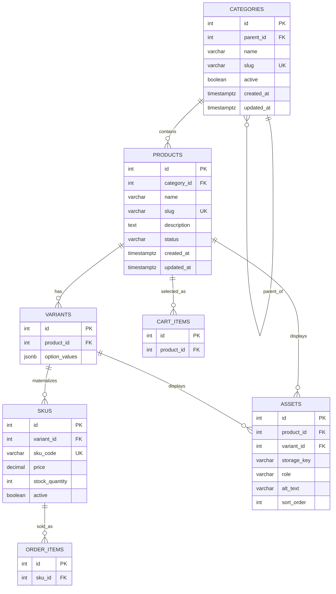

# Sprint 2: Catalog Data Foundation

## 1. Sprint goal and scope boundary

Sprint 2 extends the FashionHub Sprint 1 architecture into a reliable catalog database foundation.

### In scope
- Category tree with stable IDs and unique slugs.
- Product creation/editing with status and category.
- Variants and unique SKUs with price, stock and availability.
- Authenticated administration.
- Database constraints, migrations, seed data and automated tests.

### Out of scope
Dynamic specifications, asset upload, public catalog search, publication workflows, payment gateway integration, order placement, shipping integration and complete checkout remain outside Sprint 2.

## 2. Sprint 1 decisions reused

Sprint 1 identified FashionHub as an online clothing store. The existing stack is React.js for the frontend, Node.js with Express.js for the backend, PostgreSQL as the main relational database and Redis as an optional caching layer.

Sprint 1 already models Users, Categories, Products, Orders, Order_Items, Carts and Cart_Items. Sprint 2 keeps those concepts and adds the catalog foundation around Product, Variant and SKU.

## 3. Updated ERD and data dictionary



### Data dictionary

| Entity | Important fields |
|---|---|
| Category | id, parent_id, name, slug, active, timestamps |
| Product | id, category_id, name, slug, description, status, timestamps |
| Variant | id, product_id, option_values |
| SKU | id, variant_id, sku_code, price, stock_quantity, active |
| Asset | id, product_id/variant_id, storage_key, role, alt_text, sort_order |

Money uses PostgreSQL `NUMERIC(12,2)`, not floating point. Stock has a database `CHECK` constraint preventing negative quantities.

## 4. Administration route table

| Method | Route | Purpose |
|---|---|---|
| POST | `/api/v1/admin/login` | Authenticate administrator |
| POST | `/api/v1/admin/categories` | Create category |
| GET | `/api/v1/admin/categories` | List category tree/data |
| POST | `/api/v1/admin/products` | Create draft product |
| PATCH | `/api/v1/admin/products/:id` | Update product |
| GET | `/api/v1/admin/products` | List products |
| POST | `/api/v1/admin/products/:id/skus` | Add SKU |
| PATCH | `/api/v1/admin/skus/:id` | Update price, stock or active status |

All administrative write routes require `Authorization: Bearer <token>`.

Example product request:

```json
{
  "name": "Classic Cotton T-Shirt",
  "slug": "classic-cotton-tshirt",
  "description": "Comfortable cotton T-shirt.",
  "category_id": 1,
  "status": "draft"
}
```

A duplicate slug or SKU returns HTTP `409`. Missing required fields return `400`. Unauthenticated requests return `401`, and non-admin authenticated requests return `403`.

## 5. Data integrity and authorization decisions

1. Category slug is unique.
2. Product slug is unique.
3. SKU code is unique.
4. Price cannot be negative.
5. Stock cannot be negative.
6. Foreign keys protect relationships.
7. Category parent uses `ON DELETE SET NULL`.
8. Product category uses `ON DELETE RESTRICT`.
9. Product deletion cascades to variants/SKUs; future order records should preserve historical order information through their own order-item records.
10. Administrative write operations require an admin JWT.
11. Category cycles are prevented by application validation before changing a parent; the category cannot be its own ancestor.
12. A draft product may exist without a SKU while being prepared. A published product should have at least one active sellable SKU before publication.
13. Out-of-stock SKUs remain represented with `stock_quantity = 0` and/or `active = false`; they are not silently deleted.
14. Two SKUs may share the same price because price is stored per SKU.
15. Only valid variant combinations receive SKU records. An unavailable combination is represented by the absence of a SKU, not by a fake zero-stock SKU.

## 6. Seed-data and demonstration

The seed script creates:
- Two top-level clothing categories and child categories.
- Three products.
- One product with multiple variants.
- Four valid SKUs.
- One intentionally unavailable combination with no SKU.

Run:

```bash
npm install
npm run db:schema
npm run db:seed
```

Then start:

```bash
npm start
```

Example retrieval:

```bash
GET /api/v1/admin/products
Authorization: Bearer <admin-token>
```

Tokens and private credentials must not be committed.

## 7. Test strategy, command and result

Automated tests cover:
- required catalog data
- negative price rejection rule
- negative stock rejection rule

The project also defines database constraints for duplicate slugs, duplicate SKU codes and non-negative stock/price.

Run:

```bash
npm test
```

Expected result: all included tests pass.

## 8. Known limitations and Sprint 3 backlog

Sprint 2 intentionally does not implement dynamic specifications, asset upload, public catalog search, publication workflows, payment integration, shipping integration or complete checkout.

Sprint 3 can build on these stable category, product, variant and SKU identities for public catalog reads, dynamic specifications, assets and catalog-to-cart readiness.
